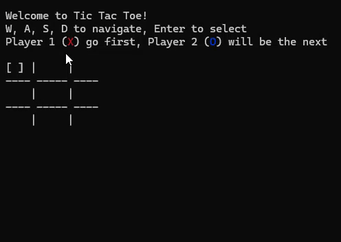

# tic-tac-toe
A simple console game to practice and recall C++

## Demo
[](assets/tic-tac-toe-demo.mp4)

## Build

### Windows (Visual Studio):
```bash
mkdir build && cd build
cmake .. -G "Visual Studio 17 2022"
cmake --build . --config Release
```

### Windows (Ninja - faster):
```bash
mkdir build && cd build
cmake .. -G "Ninja"
cmake --build .
```

### macOS:
```bash
mkdir build && cd build
cmake ..
cmake --build .
```